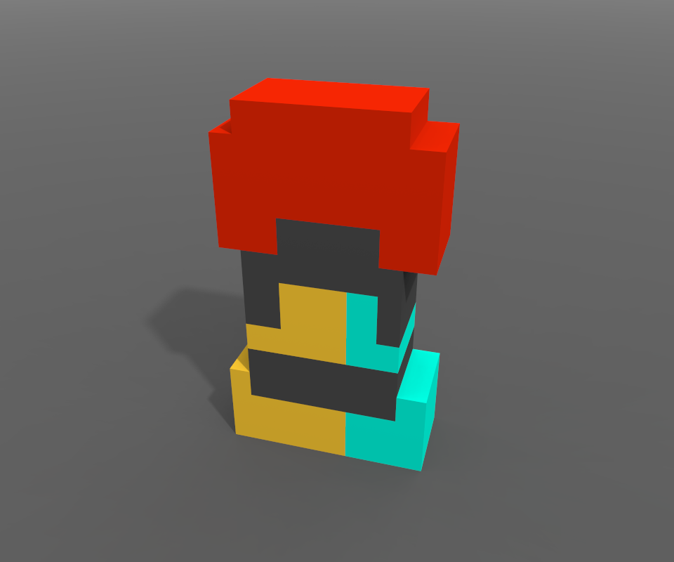
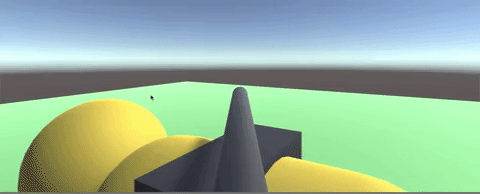

# Devlog

## 12th November

Switched the fuel texture to Voxel from MagicaVoxel.

Given how intuitive MagicaVoxel is, I think more of this game is going to be voxels now :)

## 11th November

Started blender and made a icosphere. First time using blender so :shrug:

Camera control took forever to build. Solar charging, fuel depletion mechanic is up. FTW!

Nights look fugly, I tried to hack the sun and turn it into a moon, but that looked even uglier.

Made a look alike of old ass fuel tank from road fighter. Will use it to add some fuel to the bot.

## 10th November

After making the butterfly controller, it feels like this game is gonna be too big for the weekends scope.

Now we need to switch to something else.

## 4th November

Finally got time to look at the theme and think of some ideas with Poonam.

Making a hybrid out of a dog was pretty straight-forward, "cyborg dog" fits.

- We came up with a bunch of ideas, discarded most
- Set up this repo
- Added some placeholders for dog and robot
- Added a simple mouse gun controller

## Backstory

I bought some unity assets and a course in a humble bundle. I've finished most of the course over Oct 2018, made a couple of simple tutorial-ish games and am kinda teaching Poonam now.

We have a dog named Beastie and we love her to bits. We wanted to make a game based on her quirky attitude.

I saw an announcement for Github Game off 2018 and decided to participate for fun.
