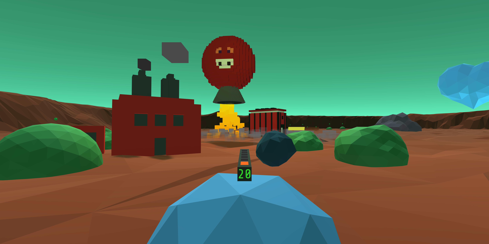
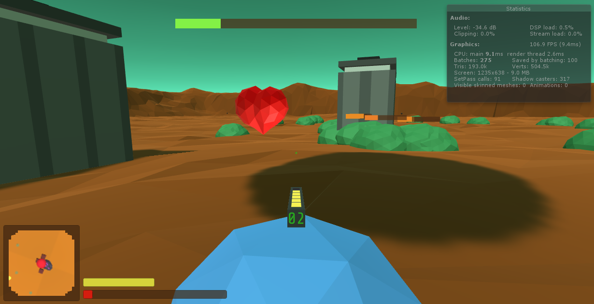
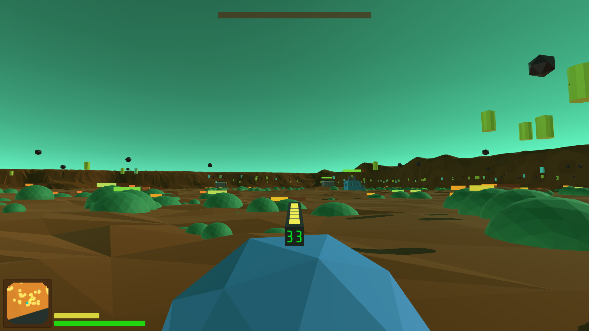
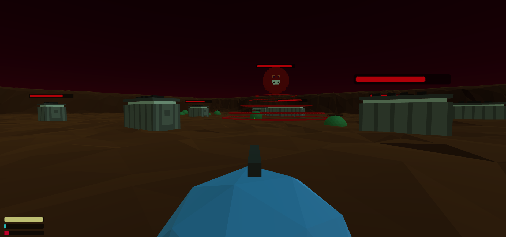
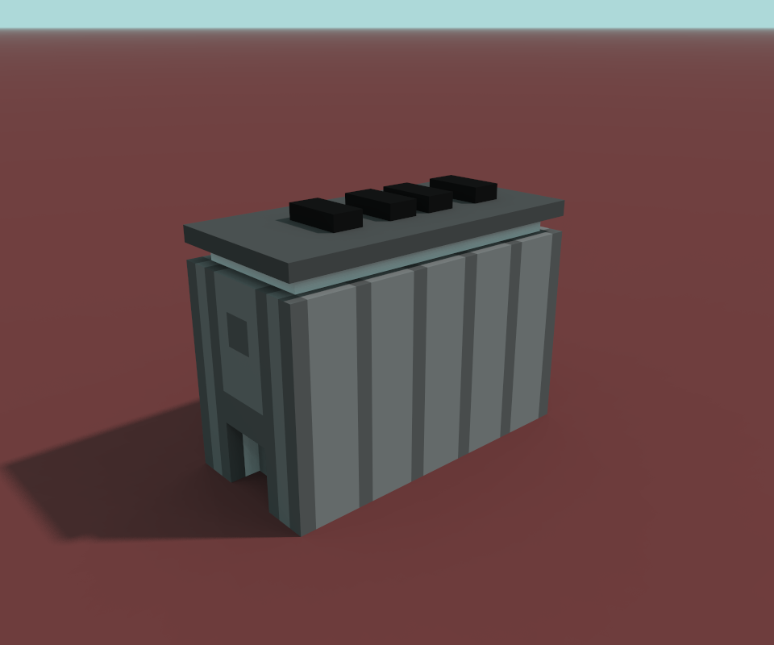
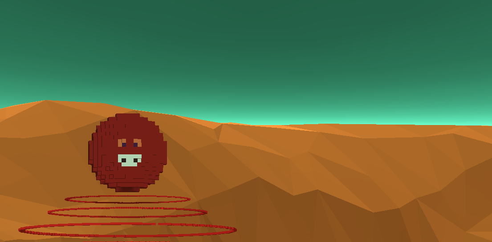

# Devlog

## 1st December
We went through a lot of changes in the last couple of days. The game may have bugs as we cut it too close to the deadline and made a bunch of last day changes.

## 29th November

We now have enemy fire and factory exhaust! Made a simple main menu from the level as a sort of sandbox for players to get used to the mechanics of the game. Designed a logo for the game and made a bunch of bugfixes today. It feels like we might have a working game after all!

## 27th November

After simplifying, the core exponential vs linear issue becomes very apparent very fast. The quick fix (considering the deadline), is to give the player a race against the clock and adjust all rates such that there is just enough time to complete the tasks in ideal-ish play. The player and we are both racing against the clock at this point.

We also have a few bugs to go through. I'll try to fix this tomorrow, too tired to do much else today.

## 26th November
The game feels too complicated at the moment. Our target audience is scrolling through the page looking for a game to play test. They will not invest loads of time trying to understand all the mechanics in the high-octane game.

I have to make different scenes to try out various individual mechanics and decide what to keep in the final version. This feels really hectic.

### Current game

#### Backstory
Your planet thrives on making batteries out of crystals. You are a hybrid (organic brain + mechnical body) icosphere running on hybrid fuel (solar + charcoal).
You mine crystals with your laser mining gun.

Mining and using charcoal causes pollution, so you plant a few bushes to keep the environment clean. Bushes give you seed for more bushes and mechanical heart to boost your health.

One voxel corporate overlord decides to mine crystals and produce as many batteries as fast as they can. Factories and the enemy cause pollution and put the environment in jeopardy.

The bushes you plant can't account for the amount of pollution, you point the laser mining gun at a factory and shoot! This blows up the factory and gives you ammo.

Enemny gets pissed off and starts charging at you...

### Current mechanics

- Resource management
    * Manage pollution by planting seeds to make bushes or by killing factories.
    * Solar charges gun, gun can be used to throw seeds or shoot lasers. Can be recharged with crystals or batteries.
    * Player movement is supported by solar and burning charcoal(dropped by dying bushes).
- Third person shooter
    * Shoot lasers to kill enemy
    * Throw seeds to plant bushes.
    * Move and control like a FPS/TPS.
- Item Drop
    * Rocks drop crystals on shooting them.
    * Factories drop batteries on death
    * Bushes drop seeds and heart

### Possible simplifications
- [x] Keep single charge for both player and gun.
- [x] Remove crystals, keep charcoal only.
- [x] Introduce just pollution management first.
- [ ] Maybe make a maze level in the beginning just to get the hang of controls?

## 25th November

Improving on details. I think I am getting a the hang of blender. Added some basic sounds for health and seed pickup. And added the Pause Menu.

There is coherent logic on resource gathering. Still trying to balance the game, I might just have to make it easier to play because it is too difficult to win with the current settings.

We've planned the back story and intro. Poonam will help write it! Woot!

## 24th November

Added detailed HUD. Added minimap. Added resource spawning and pick up logic. Buffed up the enemy, trying balance fixes. It took too many days to win!

## 23rd November

Added pollution logic today. This game needs lots of balancing.

Player movement was wonky, fixed that.

Only one kind of factory was getting spawned, fixed that as well.

## 22nd November

Added some enemy and factory music. Made a very basic HUD.

## 20th November

Got very little time today.  Learnt about delegates in C# and installed BoscaCoeil. Music is going to be a challenge it feels like.

## 19th November

Making a list of things left to do in the game. From now on, we've to try hard to not let the scope creep.

## 18th November
Today was an especially productive day. Half of the mechanics look done.

Made the terrain and wrote some code. Poonam made the Voxel enemies and factories.

Enemy has area effect on the player and vegetation, player shoots enemies and factories.

Player can plant seeds, bushes grow on their own.

## 17th November
We can't use similar looking game assets from older games so the idea of taking elements from games I've loved growing up is out the window (T.T)

Given that so much of the time is already wasted, we've decided to make a shooter.

## 15th November
Morning brought a great sight. WoeUSB had completed successfully, installed Win while I got ready for work. Success!

After work, opened MS Edge to download Chrome, installed Unity Hub and all supporting software that I'd need. Typing this on my Win10.

## 14th November

I didn't want to continue dev on the mac. It's fans were going crazy and it's old and potentially close to it's EOL. The desktop has far better specs anyway.

Turns out unity doesn't officially support linux, so I had to bite the bullet and install windows on my desktop again.

Writing the bootable USB win10 image from mac wasn't easy. Ubuntu did slightly better. WoeUSB was taking too long to copy files into the USB drive, I just went to sleep halfway through the copying.

## 12th November

Switched the fuel texture to Voxel from MagicaVoxel.

Given how intuitive MagicaVoxel is, I think more of this game is going to be voxels now :)

## 11th November

Started blender and made a icosphere. First time using blender so :shrug:

Camera control took forever to build. Solar charging, fuel depletion mechanic is up. FTW!

Nights look fugly, I tried to hack the sun and turn it into a moon, but that looked even uglier.

Made a look alike of old ass fuel tank from road fighter. Will use it to add some fuel to the bot.

## 10th November

After making the butterfly controller, it feels like this game is gonna be too big for the weekends scope.

Now we need to switch to something else.

## 4th November

Finally got time to look at the theme and think of some ideas with Poonam.

Making a hybrid out of a dog was pretty straight-forward, "cyborg dog" fits.

- We came up with a bunch of ideas, discarded most
- Set up this repo
- Added some placeholders for dog and robot
- Added a simple mouse gun controller

## Backstory

I bought some unity assets and a course in a humble bundle. I've finished most of the course over Oct 2018, made a couple of simple tutorial-ish games and am kinda teaching Poonam now.

We have a dog named Beastie and we love her to bits. We wanted to make a game based on her quirky attitude.

I saw an announcement for Github Game off 2018 and decided to participate for fun.
