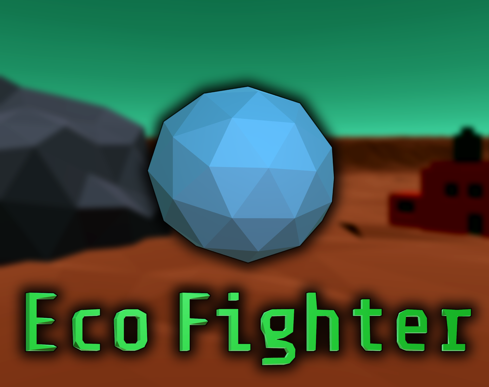

Theme for Github Game Off this year is **Hybrid**

### Theme interpretation
Player is a hybrid (organic brain + mechnical body) icosphere running on hybrid fuel (solar + charcoal) in a hybrid universe (low poly and voxel characters).

The game itself is a hybrid between a shooter and a management game. You've to keep pollution low and kill the enemy before time runs out!

### How to play

Corporate greed has run the world to the brink of environmental collapse! You have to protect the rest of us from certain doom by keeping pollution low and killing the enemy!

### Controls

Typical third person controller with mouse and arrow/WASD keys

Left click to shoot laser, Right click to throw seeds.

## Todo

- [x] Decide game theme

- [x] Make player and enemy movement

- [x] Add the concept of recharging during the day

- [x] Make low-poly terrain

- [x] Make factory prefabs

- [x] Make seed planting and bush growth

- [x] Add shooting logic

- [x] Add area of effect for enemy draining health

- [x] Add bush and factory pollution logic

- [X] Plan HUD

- [ ] Plan Game music

- [x] Plan intro and onboarding

- [x] Add Start Menu, Pause menu, Game over scene

- [x] Plan more details and animations based on time left.

- [ ] Flesh out the itch.io page

- [ ] Submit!

## Possible future directions (post Game Off)

- Add more management sim elements, work out the builder/management + third person shooter hybrid idea.
- Add a king of the hill mode where a factory or a bush would determine the winner by the end of some time.
